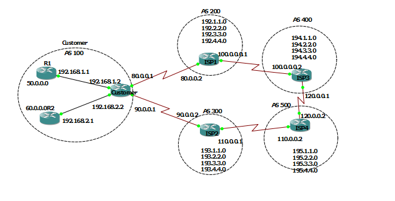
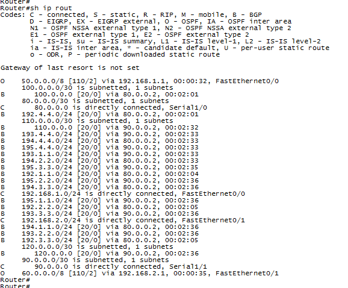
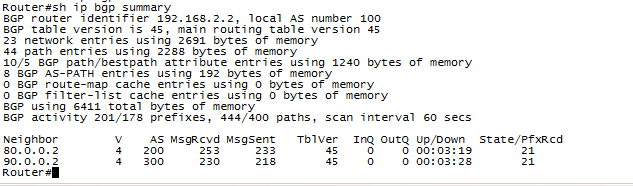
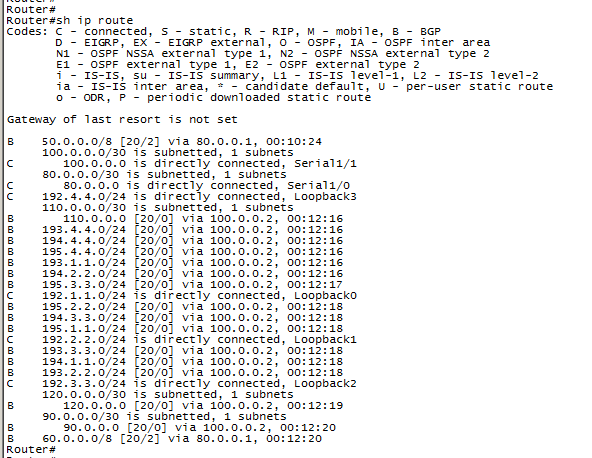
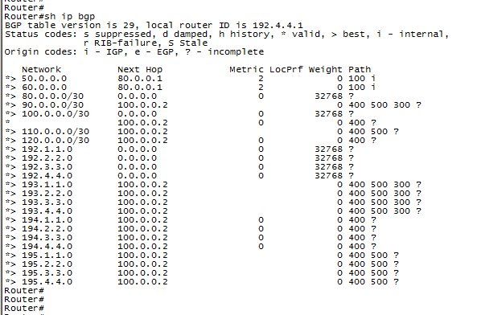

# Multi-AS BGP & OSPF Enterprise Network

**Tool:** GNS3
**Category:** Routing (BGP, OSPF, Routing Policy)

## 🎯 Objective

Design and build a simulated enterprise network with an internal OSPF domain, interconnected with multiple external Autonomous Systems (AS) via BGP, while ensuring the internal network does not act as an unintended transit path between external providers.

## 🖧 Topology Overview

- Internal network running **OSPF** as the IGP (Interior Gateway Protocol)
- **eBGP** peering established with **4 external Autonomous Systems (AS)**, interconnecting a total of **5 AS domains** (including the internal network)
- **Route redistribution** configured between BGP and OSPF for full end-to-end reachability between internal and external networks

## ⚙️ Key Configuration Highlights

- OSPF adjacency and route propagation across internal routers
- eBGP peering and AS-path handling across 4 external AS domains
- Two-way route redistribution (BGP ↔ OSPF)
- **Route-map and prefix-list filtering** to prevent external AS domains from using the internal network as a transit path — a core BGP routing-policy and security best practice

## ✅ Verification

**Routing table (Customer router)** — confirms OSPF internal routes (50.0.0.0/8, 60.0.0.0/8) and BGP external routes coexisting after successful redistribution:

**BGP summary (Customer router)** — confirms stable eBGP sessions established with AS 200 and AS 300, with routes actively received (State/PfxRcd = 21):

## 🔒 Transit-Prevention Proof

To validate that the internal network (AS 100) does not act as a transit path, verification was performed from the perspective of an external peer, **ISP1 (AS 200)**:

**Routing table from ISP1** — shows AS 300 networks reachable only via an alternate path (through AS 400/AS 500), not via the Customer router:

**BGP table from ISP1** — the Next Hop column confirms AS 300 prefixes (193.x.x.x) are learned via 100.0.0.2 (AS 400), not via 80.0.0.1 (Customer router). The Customer router only advertised its own internal networks (50.0.0.0/8, 60.0.0.0/8) — proving the transit-prevention filtering works as designed:

## 🧠 What This Project Demonstrates

- Practical understanding of multi-AS BGP peering and route exchange
- Ability to integrate BGP with an internal IGP (OSPF) through redistribution
- Awareness of BGP transit-policy risks and how to mitigate and verify them using route filtering, validated from an external peer's perspective

## 📌 Notes

This is a self-directed lab project built to apply CCNP Enterprise (Core & ENARSI) concepts in a realistic multi-AS topology. It was not part of a production environment.
