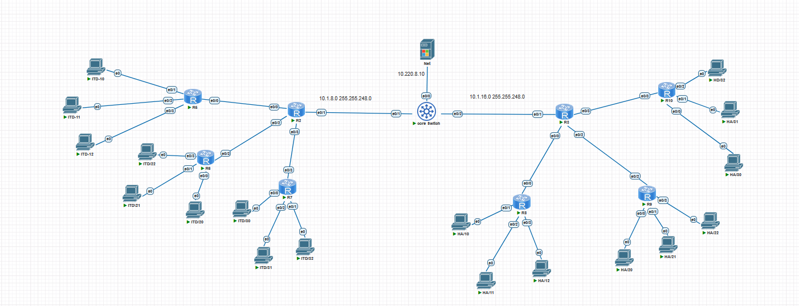
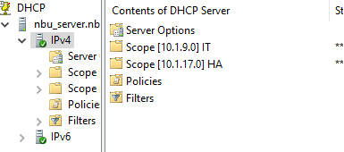
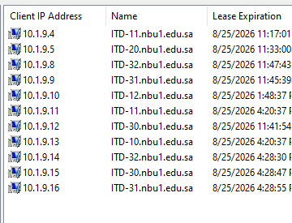
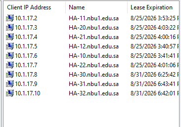
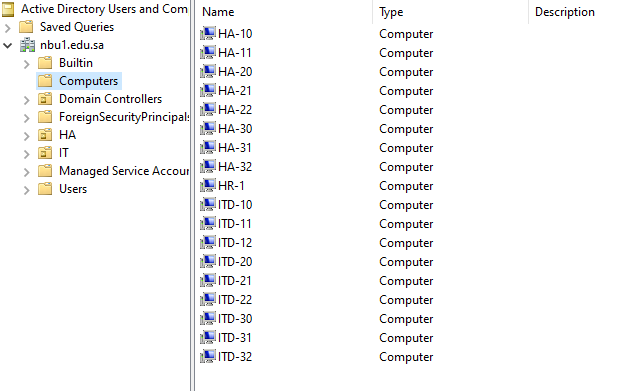
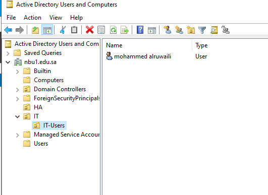

# Three-Tier Campus Network with Windows Server Domain Services

**Tool:** PNetLab
**Category:** Switching, VLANs, Windows Server Infrastructure

## 🎯 Objective

Design and build a hierarchical three-tier campus network with centralized DHCP, DNS, and Active Directory domain services — validating end-to-end connectivity and authentication across multiple VLANs.

## 🖧 Topology Overview

The network was originally designed with 3 Distribution branches. Due to VM resource constraints on the lab host, the topology was scaled down to **2 Distribution branches**, while keeping full depth and complexity per branch — prioritizing a fully functional, verifiable network over an oversized but resource-starved one.

**Final built topology:**
- **1 Core Switch**
- **2 Distribution routers**, each connecting to 3 Access-layer routers (**6 Access devices total**)
- **18 end devices** (3 per Access device)
- **1 Windows Server** providing DHCP, DNS, and Active Directory

## ⚙️ Key Configuration Highlights

- **VTP (VLAN Trunking Protocol)** configured across Distribution and Access layers to centrally propagate VLANs:
  - VLAN 2 — Data
  - VLAN 3 — Voice
  - VLAN 4 — Wi-Fi
  - VLAN 99 — Management
- **DHCP Relay (`ip helper-address`)** configured on each VLAN's SVI, allowing devices across all VLANs to reach the centralized DHCP server rather than requiring a local DHCP server per VLAN
- **Windows Server** configured with DHCP, DNS, and Active Directory Domain Services, organized into dedicated Organizational Units (OUs) per branch (IT / HA)
- All client machines joined to the Active Directory domain, with a domain user account created and validated for centralized login across domain-joined devices

## ✅ Verification

**DHCP Server structure** — separate scopes configured per branch (10.1.9.0 for IT, 10.1.17.0 for HA):

**DHCP leases — IT branch** — confirms all IT-branch devices successfully obtained IP addresses automatically:

**DHCP leases — HA branch** — confirms all HA-branch devices successfully obtained IP addresses automatically:

**Active Directory — Computers** — confirms all client machines successfully joined the domain (`nbu1.edu.sa`), organized into IT and HA Organizational Units:

**Active Directory — Domain User Account** — confirms a domain user account was created and organized under the IT-Users OU:

## 🧠 What This Project Demonstrates

- Practical design and implementation of a three-tier hierarchical switching architecture
- Centralized VLAN management using VTP across multiple switches
- DHCP Relay configuration for centralized IP address management across a segmented, multi-VLAN network
- Windows Server administration: DHCP, DNS, and Active Directory domain services, with structured OU organization
- Pragmatic scope management under real resource constraints — prioritizing a fully verified, working network over an incomplete larger one

## 📌 Notes

This is a self-directed lab project. The original design (3 Distribution branches) was scaled to 2 branches due to VM resource limitations, while preserving full architectural complexity (VTP, multi-VLAN DHCP relay, AD integration) at the reduced scale.
